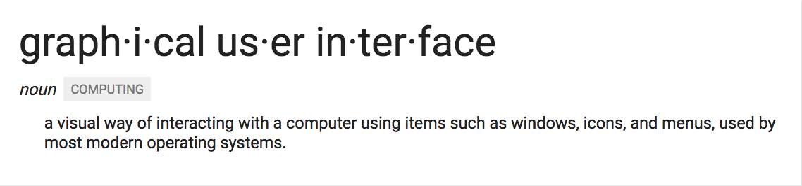

# TO DO (4/20/2017)

##### Read this: [How to use Markdown](https://github.com/adam-p/markdown-here/wiki/Markdown-Cheatsheet)
---

##### Learn CLI
 CLI is a program that runs shell scripts and allows access to your computer without needing to click through a GUI(graphical user interface) _AKA_ your finder
<<<<<<< HEAD
 
=======
 
>>>>>>> b0f27d6ef25227b5b3db3be755f1885cb6077bec
 - ##### The following are all names for your terminal
  - CLI (acronym for command line)
  - Terminal
  - bash: (this is the one that ships on MAC computers although its named Terminal it is a bash interpreter)
  - Fish: is an aftermarket one that we will download later today

Read either of these (click both and find which one is easier for you to understand) )[Link to first one](https://gist.github.com/poopsplat/7195274) [Link to second one ](https://github.com/0nn0/terminal-mac-cheatsheet)
___
<<<<<<< HEAD
### ... In progress
___

Lets check if heaters stuff is linked up

##### Christians notes [CPTs notes](https://github.com/cptcptcptcptcptcptcptcptcptcptcptcptcpt/notes)
